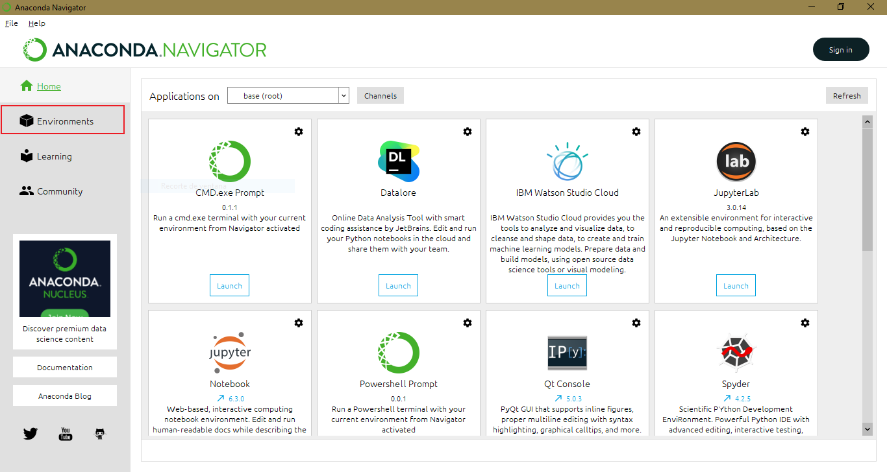
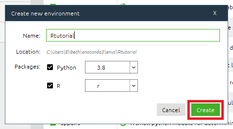
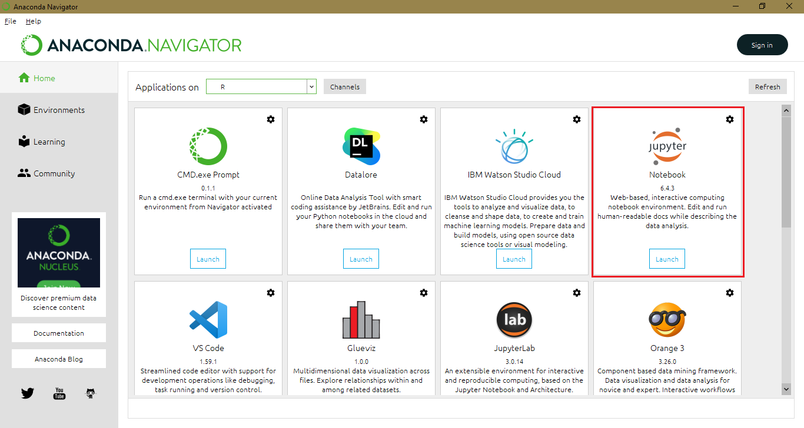
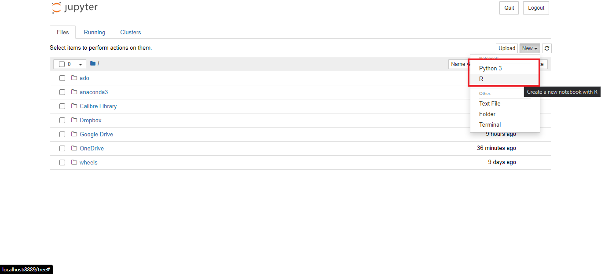
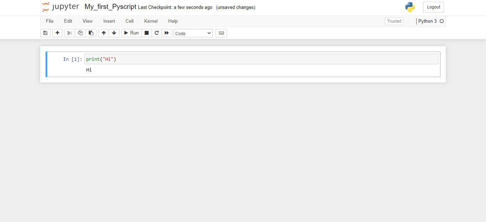
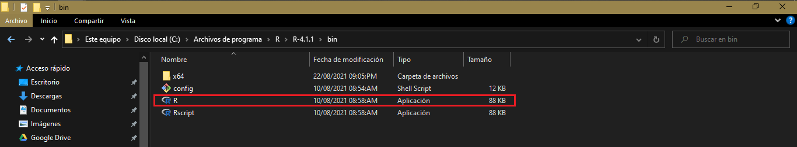
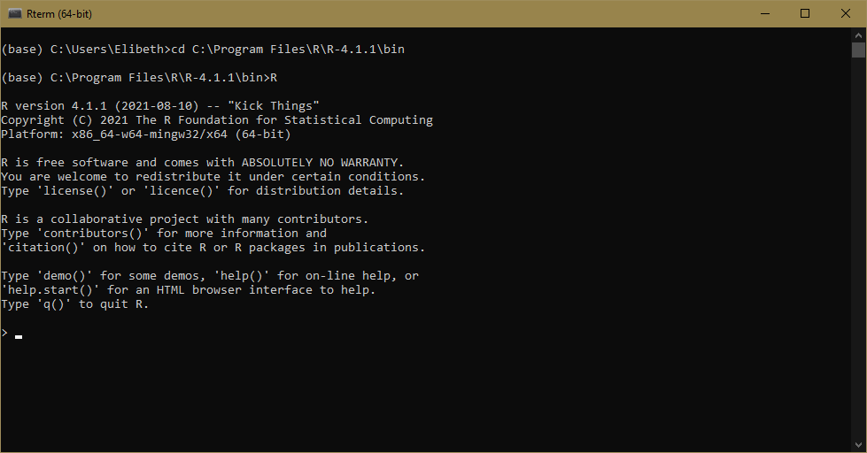

How to install Python and R in Jupyter Notebook? {-}
====================================================
 
To make it easier, we have prepared a series of cases for you to identify  and proceed with a successful installation.

- [Case 1: You have not installed Python before](#case_1)
  * [I. Installing Anaconda](#anaconda)
    + [A. Create a new environment in Anaconda to run R and Python](#environment)
    + [B. Install Ikernel to run R in base (default) environment (not creating a new environment)](#ikernel)
- [Case 2: You have installed Python or Anaconda before](#case_2)
  * [I. You just have Python installed but no Anaconda](#Py_A)
  * [II. You have Anaconda installed](#justA)


Case 1: You have not installed Python before {#case_1}
----------------------------------------------------------

We will install Anaconda first and then set up  features to run R in Jupyter. 

### Installing Anaconda {#anaconda}

Follow these steps to install Anaconda correctly:
1. The first step is to download Anaconda from its [website](https://www.anaconda.com/products/individual#windows).

2. Once downloaded, double click the installer to launch. Click Next and “I Agree”. After that, select an install for “Just Me” and click Next.

3. Then, the Anaconda installer will ask for a destination folder to install. We recommend you set it up in the default option provided. It's important to note that the directory path does not contain spaces or unicode characters.

4. The next is step is critical. In order to correctly install Anaconda for our purposes, choose **NOT** to add Anaconda to your PATH environment variable. It is also a [recommendation](https://docs.anaconda.com/anaconda/install/windows/) from Anaconda. About the second option, select "Register Anaconda3 as my default Python 3.7". 


5. Finally, click the Install button, and wait for a bit. After a successful installation, “Thanks for installing Anaconda” will pop up.

6. After installing, you will see a new program installed on your PC by typing "Anaconda" on Windows.


After installing Anaconda, we will configure the necessary options to be able to run R in a Jupyter Notebook. To do so, we have two options:

<br/>

### Create a new environment in Anaconda to run R and Python {#environment}

1. Open Anaconda Navigator.


2. Once opened, click on "Environments".


3. Click on "Create" to create a new [environment](https://docs.anaconda.com/ae-notebooks/4.0/user/anaconda/).


4. A new window will pop up. Set Python and R (as shown), and choose a name without spaces to avoid conflicts.

<div style="text-align:center"></div>

5. After waiting, you will visualize your new environment. As you can see, we named the new environment "R". 

6. To launch Jupyter Notebook, go to "Home" section, and select the new environment you've just created.


7. Wait for some minutes until your environment is setting up. Then, look for "Jupyter Notebook" and click on it.


8. It will launch Jupyter Notebook on Chrome (or your default browser). Click on "New" and select which program to run.


9. Write some code on R or Python. <br/> R script

<br/> Python script


<br/>

### Install Ikernel to run R in base (default) environment (not creating a new environment) {#ikernel}
The second option is to install some packages in R to make the kernel available to Jupyter Notebook. It can be accomplished by following these steps:

<br/>

> **_Important:_** This option requires R to have been previously installed.

<br/>

1. Firstly you will need to start R terminal. To do so, search the folder where you install R previously. In this case, we have R in <code>C:\Program Files\R\R-4.1.1\bin</code> . It will typically be there or in "Usuarios".


2. Open the Anaconda prompt. Then type <code>cd</code> (your directory) such as:

```
    cd C:\Program Files\R\R-4.1.1\bin 
```

It will set the directory to use R. So, type R to start.


3.  After that, we will install packages to use a function that makes the kernel available to Jupyter using [IRKernel](https://irkernel.github.io/installation/#windows-panel). 

4. Install the following packages by typing:

```{r eval=FALSE}
install.packages(c('repr', 'IRdisplay', 'IRkernel'), type = 'source')
```


4. It will open a CRAN mirror. Choose "USA (OR) (https)". After installing, type the following to allow the kernel spec can be installed for the current user.


```{r eval=FALSE}
IRkernel::installspec()
```

5. Follow step 6 of section \@ref(anaconda) to launch Jupyter Notebook.

<br/>

Case 2: You have installed Python or Anaconda before {#case_2}
------------------------------------------------------------------

Anaconda is an open-source distributor of Python and R. It aims to simplify package management and deployment. The packages are managed by conda system. It means it make your life easier when installing basic packages such as <code>numpy</code> or <code>pandas</code>. Therefore, it would be a lot easier to use Anaconda. 

<br/>

> **_Recommendations:_** 
>
> 1. We highly recommend uninstalling Python completely. Even some folders left can cause problems with packages in the future. So make sure you have no folders named "Python" or "Anaconda".
> 2. To uninstall Python or Anaconda correctly, it should be done from the control panel.

<br/>

### You just have Python installed but no Anaconda {#Py_A}

If you have Python installed, we encourage you to change it to Anaconda, which also has a friendly navigator called "Anaconda Navigator" to check your packages and environments. To install Anaconda correctly, Python must be removed from your system completely. [Here](https://www.educative.io/edpresso/how-to-uninstall-python) we leave you a guide to do it. After uninstalling Python, follow the steps to install Anaconda as section \@ref(anaconda) explains.

<br/>

### You have Anaconda installed {#justA}

We encourage you to uninstall Anaconda completely in order to set configurations correctly. To do so, Make sure you uninstall Anaconda correctly by following these [steps](https://docs.anaconda.com/anaconda/install/uninstall/). Even folders left can cause problems with packages in the future. So make sure you have no folders named "Python" or "Anaconda".

If you prefer to keep Anaconda as you installed it in the past, **make sure you don't have Anaconda added to your <code>PATH</code> environment, because you could have problems creating a new environment.**

<br/>

> **_Recommendations:_**
>
> 1. Uninstall Anaconda completely in order to set configurations correctly. Even folders left can cause problems with packages in the future. So make sure you have no folders named "Python" or "Anaconda".
> 2. To uninstall Python or Anaconda correctly, it should be done from the control panel.
> 3. Make sure Anaconda **IS NOT** added to your <code>PATH</code> environment, because you could have problems creating a new environment.
